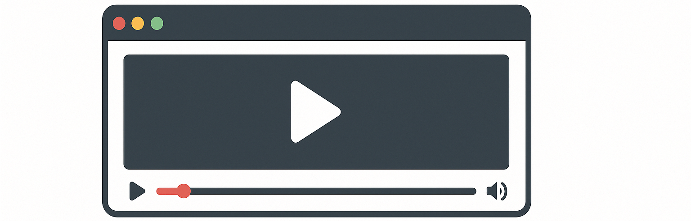

# Browser-based Video Player - Next.js 15

A modern, feature-rich video player application built with Next.js 15, React, and TypeScript. This web-based player offers a seamless video playback experience with advanced features, intuitive controls, and a beautiful responsive interface - all running directly in your browser.



## ✨ Features

- 🎥 Support for multiple video formats
- 📁 Local folder and file selection
- 📋 Playlist management with natural ordering
- 🕒 Recent videos history
- 🖥️ Multiple window size options
- 📱 Fully responsive design
- ⌨️ Comprehensive keyboard shortcuts
- 🖼️ Picture-in-Picture mode
- 🎚️ Volume control with mute option
- ⏭️ Next/Previous video navigation
- 🔄 Auto-play next video
- 📺 Fullscreen mode

## 🚀 Live Demo

Experience the video player live: [Demo Link](https://next-browser-video-player.vercel.app/)

## 📖 Documentation

- [Technical Documentation](./TECHNICAL.md) - Architecture, components, and implementation details
- [Functional Guide](./FUNCTIONAL.md) - Feature explanations and use cases
- [Operation Manual](./OPERATIONS.md) - Installation, deployment, and usage instructions

## 🛠️ Quick Start

```bash
# Clone the repository
git clone https://github.com/shahedfardous/browser-based-video-player.git

# Navigate to project directory
cd browser-video-player

# Install dependencies
npm install

# Run development server
npm run dev

# Open browser at http://localhost:3000
```

## 💻 Technologies

- **Next.js 15** with App Router architecture
- **React 18** for UI components
- **TypeScript** for type safety
- **Tailwind CSS** for styling
- **Lucide React** for icons

## 🌐 Browser Compatibility

Tested and working on:
- Chrome 90+
- Firefox 88+
- Safari 14+
- Edge 90+
- Opera 76+

## 📝 Use Cases

- **Personal Media Library**: Organize and play your personal video collection
- **Content Creation**: Preview video content before publishing
- **Presentations**: Play video segments during presentations
- **Educational Settings**: Display instructional videos in classrooms
- **Offline Viewing**: Watch videos without internet connectivity
- **Development**: Reference implementation for Next.js 15 App Router

## 🔜 Roadmap

- [ ] Subtitle support
- [ ] Video quality selection
- [ ] Playback speed control
- [ ] Streaming URL support
- [ ] Video thumbnails
- [ ] Drag-and-drop playlist ordering
- [ ] Keyboard shortcuts customization
- [ ] Audio file support

## 🙏 Acknowledgements

- [Next.js](https://nextjs.org/) for the application framework
- [Lucide Icons](https://lucide.dev/) for the beautiful icons
- [Tailwind CSS](https://tailwindcss.com/) for the styling system
- [Netlify](https://netlify.com/) for hosting

## 👨‍💻 Author

**Shahed Fardous**
- GitHub: [github.com/shahedfardous](https://github.com/shahedfardous)
- Portfolio: [www.shahedfardous.com](https://www.shahedfardous.com)

## 📄 License

This project is licensed under the MIT License - see the [LICENSE](LICENSE) file for details.